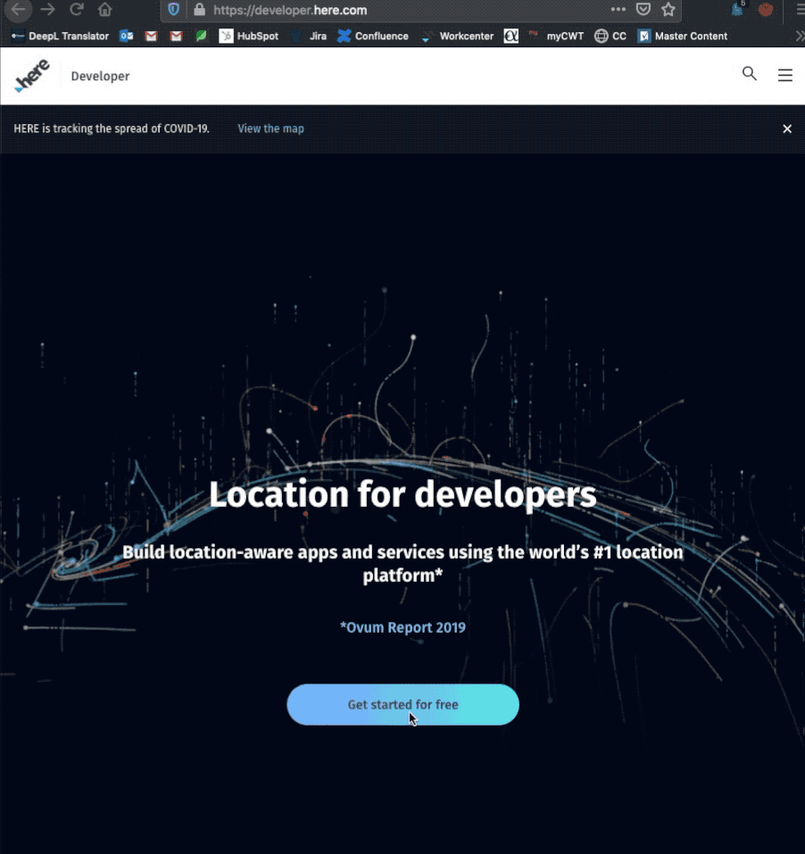

 

In this workshop we will learn to use the JavaScript APIs from the HERE Location Suite.

#### Step 1 : We render a map and place a marker on our current position with a custom image
#### Step 2 : We search for all takeout restaurants around us and place markers on them
#### Step 3 : We will find and draw a route from one of the restaurants
#### Step 4 : We will display instructions to follow the route.
#### Beyond : Final code with visual customizations.

# To access any of the APIs, first get your credentials by signing up for a freemium account

[Register](https://developer.here.com/events/community-france) for a free developer account 

# Generate apikeys

# Join our Slack
 Join the channel *weu-workshop*

# Let's begin!

 

