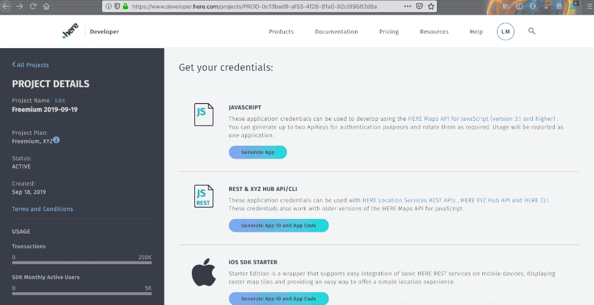

 
# HERE JavaScript Workshop 
In this workshop we will learn to use the JS and REST APIs from the HERE Location Suite.

#### Step 1 : We render a map and place a marker on our current position
#### Step 2 : We Geocode all stores selling Christmas trees around us and place markers on them
#### Step 3 : We draw a cirle around our position
#### Step 4 : We use isoline routing to find the stores actually closest to us.
#### Beyond : Final code with visual customizations.

# Click to join our slack channel tu-mainz

 

# To access any of the APIs, first get your credentials by signing up for a freemium account

[Register here](https://developer.here.com/events/community-germany) for a free developer account 
# Generate apikey , app_id and app_code

# Let's begin!

 

